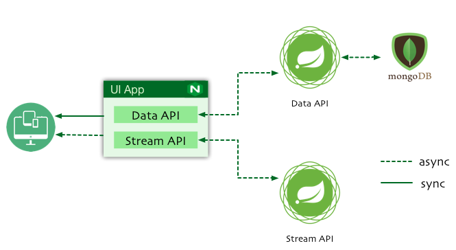

Reactive Apps
=============
A simple demo application showcases end-to-end `Functional Reactive Programming (FRP)` with Spring 5.



##### Technology stack
* Spring Framework 5
* Spring Boot 2.0.0
* Spring WebFlux
* Embedded MongoDB
* Reactive MongoDB Driver
* Gradle 4

##### Highlights
* Use of Server-Sent Events (SSE) rendered in HTML by Thymeleaf from a reactive data stream.
* Use of Server-Sent Events (SSE) rendered in JSON by Spring WebFlux from a reactive data stream. 
* Use of Spring Data MongoDB's reactive (Reactive Streams) driver support.
* Use of Spring Data MongoDB's support for infinite reactive data streams based on MongoDB tailable cursor (see [here](https://docs.mongodb.com/manual/core/tailable-cursors/)). 
* Use of Thymeleaf's fully-HTML5-compatible syntax.
* Use of `webjars` for client-side dependency managements.
* Reactive Netty as a server
* Multi-project builds with Gradle Kotlin Script. 
* Kotlin as a language
* Cross-Origin Resource Sharing (CORS)
* Docker deployment


### Prerequisites
* Gradle 4 or later.
> Recommended to install Gradle with [sdkman](http://sdkman.io)
```bash
sdk install gradle 4.0
```

> use `./gradlew` instead of `gradle` until 4.0 is released.

### Building
```bash
# build all 3 executable jars
gradle build
# continuous build with `-t`. 
# this shoud be started before any run tasks i.e., `gradle ui-app:bootRun`, for spring's devtools to work.
gradle -t build
# build all 3 docker images
gradle docker
```

### Testing
```bash
gradle test
```

### Running
##### Manual 
Start all 3 apps: [mongo-data-service](./mongo-data-service/), [stream-service](./stream-service/), [ui-app](./ui-app/)
##### Docker
You can also build Docker images and run all via `Docker Compose`
```bash
# start containers in the background
docker-compose up -d
# start containers in the foreground
docker-compose up 
# show runnning containers 
docker-compose ps
# scaling containers and load balancing
docker-compose scale stream=2
# 1. stop the running containers using
docker-compose stop
# 2. remove the stopped containers using
docker-compose rm -f
```
>Access UI App at http://localhost:8080


### Gradle Commands
```bash
# upgrade project gradle version
./gradlew wrapper --gradle-version=4.0-rc-2
# gradle daemon status 
gradle --status
gradle --stop
```

### Credits
* [MiXiT](https://github.com/mixitconf/mixit)
* [Stéphane Nicoll](https://github.com/snicoll-demos/demo-webflux-streaming)
* [Daniel Fernández](https://github.com/danielfernandez/reactive-matchday)

